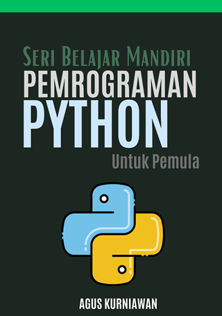

# Seri Belajar Mandiri: Pemrograman Python Untuk Pemula

**Seri Belajar Mandiri: Pemrograman Python Untuk Pemula** adalah panduan komprehensif yang dirancang khusus untuk memperkenalkan Anda ke dunia pemrograman menggunakan Python, salah satu bahasa pemrograman yang paling banyak digunakan dan mudah dipelajari saat ini. Buku ini menawarkan pendekatan langkah demi langkah untuk memahami dasar-dasar Python, dari sintaks dasar hingga konsep pemrograman berorientasi objek yang lebih kompleks.

Di awal buku, Anda akan diperkenalkan dengan sejarah dan filosofi Python, memberikan Anda pemahaman tentang mengapa dan bagaimana Python menjadi begitu populer di kalangan pengembang. Selanjutnya, buku ini secara bertahap memandu Anda melalui konsep-konsep dasar seperti variabel, tipe data, operasi, kontrol alur, fungsi, dan modul, semuanya disajikan dengan contoh yang mudah diikuti dan latihan praktis. Anda juga akan belajar tentang struktur data seperti list, tuple, dictionary, dan set, serta bagaimana menggunakannya untuk menyimpan dan mengelola data secara efektif.

Selain itu, buku ini menggali lebih dalam ke aspek-aspek lanjutan seperti penanganan kesalahan dan pengecualian, bekerja dengan file dan direktori, dan menggunakan modul-modul standar Python. Anda akan mendapatkan keterampilan yang diperlukan untuk menulis program Python yang bersih, efisien, dan terstruktur baik. Bab-bab lanjutan juga membahas topik seperti OOP, memberikan Anda dasar yang kuat dalam konsep seperti kelas, objek, pewarisan, dan polimorfisme.

## Cara Mendapatkan Buku Ini

Buah ini tersedia di toko buku ini:
* Google Play Books: [https://play.google.com/store/books/details?id=7Q_qEAAAQBAJ](https://play.google.com/store/books/details?id=7Q_qEAAAQBAJ)
* Lulu: [https://www.lulu.com/shop/agus-kurniawan/seri-belajar-mandiri-pemrograman-python-untuk-pemula/ebook/product-955j55y.html](https://www.lulu.com/shop/agus-kurniawan/seri-belajar-mandiri-pemrograman-python-untuk-pemula/ebook/product-955j55y.html)